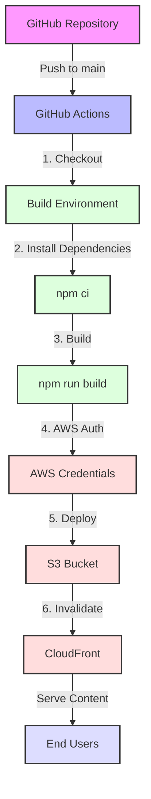

## 배포 파이프라인 설명

1. **GitHub 저장소**
   - 메인 브랜치에 코드 푸시 시 워크플로우 트리거
   - GitHub Actions 실행 환경 구성

2. **GitHub Actions**
   - Ubuntu 최신 버전에서 실행
   - 워크플로우 단계별 실행 관리
   - 빌드 및 배포 자동화

3. **빌드 환경**
   - Node.js 20 버전 사용
   - npm 캐시 활용
   - TypeScript 컴파일

4. **AWS 서비스**
   - S3: 정적 파일 호스팅
   - CloudFront: CDN 및 캐시 관리
   - IAM: 보안 자격 증명 관리

5. **최종 사용자**
   - CloudFront를 통한 전세계 엣지 로케이션 접근
   - 최적화된 콘텐츠 전송
   - 낮은 지연 시간 
